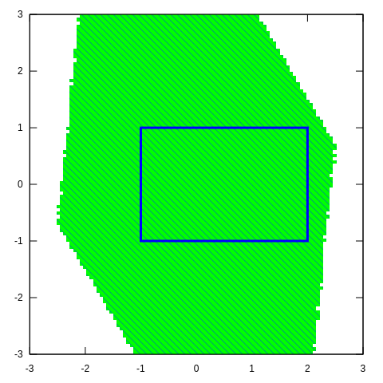

# SAW
A Tool for Safety Analysis of Weakly-hard Systems

### Dependency

| Names                           | Weblinks                           |
| ------------------------------- | ---------------------------------- |
| GNU MPFR Library                | http://gmplib.org/                 |
| GNU MPFR Library                | http://www.mpfr.org/               |
| GNU Scientific Library          | http://www.gnu.org/software/gsl/   |
| GNU Linear Programming Kit      | http://www.gnu.org/software/glpk/  |
| Bison - GNU parser generator    | http://www.gnu.org/software/bison/ |
| Flex: The Fast Lexical Analyzer | http://flex.sourceforge.net/       |
| Gnuplot                         | http://www.gnuplot.info/           |
| Boost C++ Library               | https://www.boost.org/             |

### Installation

We provide two ways to install the program.

* Build in your own environment.

  ```
  make
  ```

  **Warning:** We strongly suggest you using **g++-8** to build the project.

* Docker image

  ```
  TODO
  ```

### Usage

1. Create a model file as follow format.

   ```
   <state_dim> <input_dim>
   <safe_distance> <grid_count>
   <state_var_names> <input_var_names>
   <state_ode.1>
   ...
   <state_ode.state_dim>
   <input_equa.1>
   ...
   <input_equa.input_dim>
   <period> <step_size>
   <m> <k>
   <initial_state.1>
   ...
   <initial_state.state_dim>
   ```

2. You can also modify the configuration of *Flow\**.

   ```
   <order>
   <cutoff_threshold>
   <queue_size>
   <remainder_estimation>
   ```

3. Execute the verification tool with the model file.

   ```
   ./saw model.txt
   ```

   You can run the example model in *example/*.

   ```
   ./saw example/model1.txt
   ./saw example/model3.txt
   ```

4. The result of *model3* is as follow:

   ```
   [Info] Parsing model.
   [Info] Building FLOW* configuration.
   [Info] Building grids.
   [Info] Building one-step graph.
          Process: 100.00%
   [Success] Number of edges: 20080
   [Info] Building K-step graph.
   [Success] Start Region Size: 1700
             End Region: 86
             Number of Edges: 89162
   [Info] Finding the largest closed subgraph.
   [Success] Safe Initial Region Size: 1700
   ```

   The program will plot the region of first two dimensions to *output.svg*.

   

   
